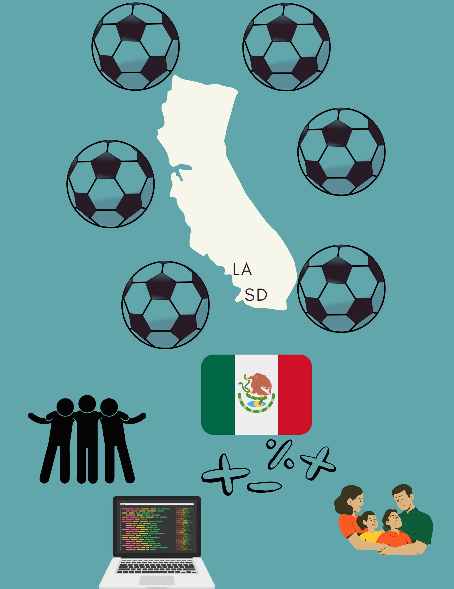

## Build you Home Page here 
This is about your journey. Start now!!!

## Overview of Hacks, Study and Tangibles
Blogging in GitHub pages is a way to learn and code at the same time. 

- Favorite Soccer Player:
https://media1.giphy.com/media/v1.Y2lkPTc5MGI3NjExa2FhbXBjeTgydjc0anpvZGNhaWlsYndpcjZncmw3M3J6M2ZzamN4aCZlcD12MV9naWZzX3NlYXJjaCZjdD1n/PnPU9GhN3V7oVizSHG/giphy.gif
- Lionel Messi
- Plans, Lists, [Scrum Boards](https://clickup.com/blog/scrum-board/) help you to track key events, show progress and record time.  Effort is a big part of your class grade.  Show plans and time spent!
- [Hacks(Todo)](https://levelup.gitconnected.com/six-ultimate-daily-hacks-for-every-programmer-60f5f10feae) enable you to stay in focus with key requirements of the class.  Each Hack will produce Tangibles.
- Tangibles or [Tangible Artifacts](https://en.wikipedia.org/wiki/Artifact_(software_development)) are things you accumulate as a learner and coder. 
- Hello World!
